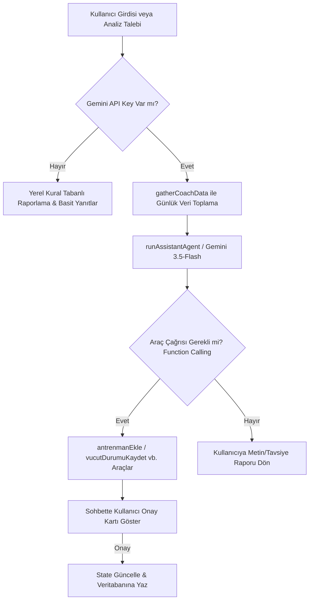

# 🏃‍♂️ TriTrack Yapay Zeka Geliştirme ve Özelleştirme Analiz Raporu 🤖

Bu rapor, **TriTrack** uygulamasındaki mevcut Gemini tabanlı yapay zeka asistanını (AI Koç), koşucular ve triatletler için bilimsel verilere dayalı, profesyonel bir dayanıklılık sporları koçuna dönüştürmek amacıyla hazırlanmıştır. 

Projenin mevcut yapısı (istemci taraflı PWA) göz önünde bulundurularak, yapay zekanın nasıl eğitilebileceği, entegrasyon yöntemleri, dünyadaki örnek çalışmalar ve adım adım teknik yol haritası aşağıda detaylandırılmıştır.

---

## 1. Yönetici Özeti (Executive Summary)

Mevcut TriTrack yapay zeka asistanı, kullanıcının o günkü vücut durumu (uyku, HRV), beslenme makroları ve son antrenman kayıtlarına dayanarak Gemini 3.5-Flash modeli ile genel toparlanma ve antrenman önerileri sunmaktadır. Ancak, dayanıklılık sporları (koşu, bisiklet, yüzme) son derece teknik, veri yoğun ve fizyolojik sınırlara dayalıdır.

AI Koç'u koşucu ve triatletler için "eğitilmiş/özelleştirilmiş" hale getirmek için **üç ana katman** entegre edilmelidir:
1. **Fizyolojik Veri Bağlamı:** Yapay zekaya sadece "antrenman süresi" değil, uygulamada halihazırda hesaplanan **CTL/ATL/TSB (Form ve Antrenman Yükü)** ve **Z1-Z5 Nabız Bölgeleri** gibi kritik spor bilimleri verilerinin beslenmesi.
2. **Bilimsel Metot Entegrasyonu:** İstem şablonlarına (Prompting) dayanıklılık antrenmanı teorilerinin (**Polarize Antrenman (80/20)**, **Jack Daniels VDOT Tempo Bölgeleri**, **Joe Friel Antrenman Planlaması**) kurallar halinde tanıtılması.
3. **Hibrit Mimari:** Saf LLM (Büyük Dil Modeli) üretimine güvenmek yerine, hesaplamaları kod tarafında (deterministik) yapıp, yapay zekayı bu verileri yorumlayan ve sporcuya empatiyle açıklayan bir "arayüz/koç" olarak konumlandırmak.

---

## 2. TriTrack Mevcut AI Altyapısı ve Sınırları

Uygulamanın kaynak kodları ([app.js](file:///c:/Users/User/Desktop/Fitness%20Takip/app.js) Bölüm 9 & 9.5) incelendiğinde yapay zeka sisteminin şu anki akışı şöyledir:



### Mevcut Sınırlar:
* **Eksik Fizyolojik Bağlam:** [app.js](file:///c:/Users/User/Desktop/Fitness%20Takip/app.js) içindeki `gatherCoachData()` fonksiyonu yapay zekaya yalnızca son 6 antrenmanın listesini ve haftalık toplam antrenman dakikalarını gönderir. Ancak uygulamada arka planda hesaplanan **CTL/ATL/TSB (Form, Yük, Yorgunluk)** eğrisi ve **Nabız Bölgeleri** dağılımı AI'ya gönderilmemektedir.
* **Genel Prompt Yapısı:** İstemler yapay zekaya *"Sen triatlet ve koşucular için profesyonel bir antrenörsün"* dese de, spesifik antrenman teorilerine atıfta bulunmamakta ve sporcunun nabız/tempo bölgelerine göre özel hedef süreleri üretememektedir.

---

## 3. Yapay Zekayı Dayanıklılık Sporları İçin Özelleştirme Yöntemleri

Bir yapay zekayı belirli bir uzmanlık alanında (koşu/triatlon) geliştirmek için 3 ana teknik yaklaşım mevcuttur:

| Yöntem | Teknik Tanım | Avantajları | Dezavantajları / Riskler | TriTrack İçin Uygunluk |
| :--- | :--- | :--- | :--- | :--- |
| **1. Prompt Engineering & Sistem Talimatları** | Yapay zekaya sistem istemi (`systemInstruction`) üzerinden antrenörlük teorilerini kurallar halinde öğretmek. | Hızlı, sıfır ek maliyet, anında uygulanabilir. | Bağlam penceresi sınırlıdır, çok karmaşık formülleri çözemeyebilir. | **Çok Yüksek (Hemen Başlanmalı)** |
| **2. Veri Bağlamı ve RAG (Retrieval-Augmented Gen.)** | Antrenman kitaplarını (örn. Joe Friel, Jack Daniels) ve sporcunun tüm geçmiş verilerini bir veri tabanından sorgulayıp prompta eklemek. | Halüsinasyonu sıfıra indirir, bilimsel kaynak gösterebilir. | Vektör veritabanı veya ek sunucu/API gereksinimi (istemci taraflı yapıyı zorlaştırabilir). | **Orta (Orta Vade Planı)** |
| **3. İnce Ayar (Fine-Tuning)** | Gemini veya LLaMA gibi açık kaynaklı bir modeli binlerce antrenman diyaloğu ve planıyla eğitmek. | Markaya özel tonlama ve çok derin antrenörlük stili. | Yüksek veri toplama maliyeti, halüsinasyon riskini çözmez, güncellemesi zordur. | **Düşük (Önerilmez)** |

> [!IMPORTANT]
> **Neden Fine-Tuning Yapmamalıyız?**
> İnce ayar (Fine-tuning), modellerin konuşma üslubunu ve biçimini değiştirmek için harikadır; ancak **bilgi doğruluğunu garanti etmez**. Bir triatlon koçunun sporcuya *"HRV'n 45ms ve CTL'in düştüğü için bugün koşmamalısın"* demesi için ince ayara değil, **kesin verilere (deterministic datalara)** ihtiyacı vardır. Yapay zeka doğrudan matematik hesaplayamaz, dolayısıyla en iyi yaklaşım **Kural Tabanlı Motor + LLM Arayüzü (RAG/Prompting)** birlikteliğidir.

---

## 4. Dünyada Yapılmış Çalışmalar ve Rakip Analizi

Dayanıklılık sporlarında yapay zekayı kullanan öncü platformlar ve teknik yaklaşımları şunlardır:

### 1. Athletica.ai (Science-First AI Coaching)
* **Yaklaşım:** Tamamen spor bilimi algoritmalarına dayanır. Egzersiz fizyoloğu Prof. Paul Laursen tarafından geliştirilmiştir.
* **Nasıl Çalışır:** LLM'leri doğrudan plan yapmak için kullanmazlar. Sporcunun antrenman verilerinden (Garmin/Strava) gelen nabız, güç ve toparlanma değerlerini deterministik algoritmalarla işlerler (CTL/ATL hesabı, tempo bölgeleri sapmaları). Yapay zeka (LLM), bu matematiksel sonuçları sporcuya anlaşılır, motivasyonel ve insansı bir dille açıklayan bir koç arayüzü olarak hizmet verir.

### 2. Humango.ai (Dynamic & Social Coaching)
* **Yaklaşım:** Bireysel programlama ve toparlanma takibinde yapay zeka ajanları (AI Agents) kullanır.
* **Nasıl Çalışır:** Sporcu hastalandığında, iş seyahatine çıktığında veya bir antrenmanı kaçırdığında, yapay zeka ajanı tüm haftalık triatlon planını (yüzme, bisiklet, koşu dengesini bozmadan) anlık olarak yeniden planlar.

### 3. TrainAsONE (Koşu Odaklı Makine Öğrenimi)
* **Yaklaşım:** Veriye dayalı kestirimci modelleme.
* **Nasıl Çalışır:** Milyonlarca koşu kilometresini analiz eden özel makine öğrenimi modelleri kullanarak sporcunun sakatlanma riskini ve hedef yarış derecesini (örneğin maraton süresi tahmini) tahmin eder.

---

## 5. TriTrack İçin Adım Adım Teknik Geliştirme Planı

TriTrack'in mevcut yapısını bozmadan, yapay zekayı gerçek bir koşu ve triatlon koçuna dönüştürmek için 3 aşamalı bir yol haritası uygulayabiliriz:

### Faz 1: Fizyolojik Veri Bağlamının Zenginleştirilmesi (Hemen Yapılabilir)
Şu anda `gatherCoachData()` yapay zekaya yalnızca temel bilgileri göndermektedir. İlk adım olarak, uygulamada zaten hesaplanan gelişmiş metrikleri yapay zekaya parametre olarak sunmalıyız.

* **Eklenecek Veriler:**
  * **CTL (Fitness):** Sporcunun kronik antrenman yükü (son 42 günün ortalaması).
  * **ATL (Fatigue):** Sporcunun akut antrenman yükü / yorgunluğu (son 7 günün ortalaması).
  * **TSB (Form):** CTL - ATL farkı. Sporcunun dinlenmiş mi (taze) yoksa aşırı yorgun mu olduğunu gösterir.
  * **Maksimum Nabız (maxHr) ve Nabız Bölgeleri Dağılımı:** Sporcunun son 28 günde hangi bölgelerde (Z1: Kolay toparlanma - Z5: Maksimum kapasite) ne kadar süre geçirdiği.

```diff
// app.js - gatherCoachData() içine eklenebilecek bağlam verileri:
function gatherCoachData() {
  const todayDiet = state.diet.filter(f => f.date === currentDateStr);
  const diet = { cal: 0, p: 0, c: 0, f: 0 };
  todayDiet.forEach(f => { diet.cal += f.calories; diet.p += f.protein; diet.c += f.carbs; diet.f += f.fat; });

  const thisMon = mondayOf(currentDateStr);
+ const loadBalance = computeFitnessFatigue(28); // CTL, ATL, Form verilerini al
+ const maxHr = state.profile.maxHr || 190;
+ // Son 28 günlük nabız bölgesi dağılımlarını hesapla ve ekle

  return {
    diet,
    body: state.holisticLogs[currentDateStr] || {},
    avg7: {
      sleep: avgOf(holisticValues('sleep', 0, 6)),
      score: avgOf(holisticValues('sleepScore', 0, 6)),
      hrv: avgOf(holisticValues('hrv', 0, 6))
    },
    load: { thisWeek: weekMinutes(thisMon), lastWeek: weekMinutes(addDaysStr(thisMon, -7)) },
+   metrics: {
+     ctl: Math.round(loadBalance.ctl),
+     atl: Math.round(loadBalance.atl),
+     form: Math.round(loadBalance.form)
+   },
+   maxHr,
    recent: state.workouts.filter(w => w.source !== 'strava').slice().sort((a, b) => (a.date < b.date ? 1 : -1)).slice(0, 6),
    readiness: computeReadiness()
  };
}
```

---

### Faz 2: Sistem İsteminin (System Prompt) Spor Bilimi Teorileriyle Güncellenmesi
Yapay zekanın sistem talimatlarını (system prompt) güncelleyerek ona dayanıklılık sporlarındaki en önemli metodolojileri rehber olarak sunmalıyız.

* **Sistem Promptuna Eklenecek Kurallar:**
  1. **80/20 Kuralı (Polarize Antrenman):** AI, antrenmanların %80'inin kolay (Z1-Z2 nabız veya konuşma temposunda), %20'sinin ise yüksek yoğunluklu (Z4-Z5 veya interval) olması gerektiğini bilmeli. Öneri yaparken bu oranı gözetmeli.
  2. **TSB (Form) Kuralları:**
     * TSB > +5 ise: "Sporcu taze ve dinlenmiş durumda. Zorlu bir interval veya yarış simülasyonu planlayabilirsin."
     * TSB -10 ile +5 arasında ise: "Dengeli yüklenme bölgesi. Mevcut plana sadık kalmasını söyle."
     * TSB < -15 ise: "Aşırı antrenman (Overtraining) riski var. Kesinlikle toparlanma/aktif dinlenme öner."
  3. **HRV ve Uyku Duyarlılığı:** HRV değeri 14 günlük ortalamanın %10'undan fazla düştüyse veya uyku puanı 60'ın altındaysa, o günkü zor antrenmanları kolay antrenmanlarla değiştirmesini önermeli.
  4. **Kullanıcı Hedefine Göre Özelleşme:** Kullanıcının antrenman yoğunluğuna ve hedefine göre (Maraton, Sprint Triatlon, Ironman vb.) özelleştirilmiş öneriler sunma kuralları.

---

### Faz 3: Gelişmiş Ajan Yetenekleri (Function Calling ile Dinamik Planlama)
Mevcut asistan zaten antrenman ve plan ekleme yeteneğine (`antrenmanPlaniEkle` aracı) sahiptir. Bu yetenek genişletilerek yapay zekanın **antrenman planlarını otomatik revize etmesi** sağlanabilir.

* **Örnek Senaryo:**
  * **Sporcu:** *"Bugün bacaklarım çok yorgun hissediyor ve HRV puanım düşük çıktı."*
  * **AI Koç:** `gunVerisiniGetir` ile bugünün planına bakar. Bugün için planlanmış 15 km'lik zor bir tempo koşusu olduğunu görür.
  * **AI Koç:** *"Bugün vücudun sinyaller veriyor. 15 km tempo koşusu yerine planı 40 dakikalık kolay bir toparlanma koşusu (Z1-Z2) olarak güncellemeyi öneriyorum. Onaylıyor musun?"* der ve `antrenmanPlaniEkle` (veya plan güncelleme fonksiyonu) çağrısı yaparak ekrana onay kartı çıkartır.

---

## 6. Önerilen Geliştirme Yol Haritası (Kullanıcıya Yol Gösterici)

Eğer bu projeyi bir sonraki aşamaya taşımak isterseniz, aşağıdaki adımları sırayla takip edebilirsiniz:

1. **Adım:** [app.js](file:///c:/Users/User/Desktop/Fitness%20Takip/app.js) içerisindeki `gatherCoachData()` ve `coachReportPrompt()` fonksiyonlarını güncelleyerek CTL, ATL, Form (TSB) ve Nabız Bölgesi verilerini istemlere ekleyin.
2. **Adım:** Sistem istemini (`assistantSystemPrompt()`) yukarıda paylaşılan spor bilimleri kurallarıyla donatın.
3. **Adım:** Test etmek için Profil sekmesinden Gemini API anahtarınızı girin ve "Asistan" sekmesinden *"Son antrenmanlarımı ve yük dengemi inceleyip yarın için nasıl bir bisiklet antrenmanı yapmam gerektiğini söyler misin?"* yazarak AI'ın analiz yeteneğini sınayın.

---
*Bu analiz raporu TriTrack v1.23 codebase mimarisi temel alınarak hazırlanmıştır.*
